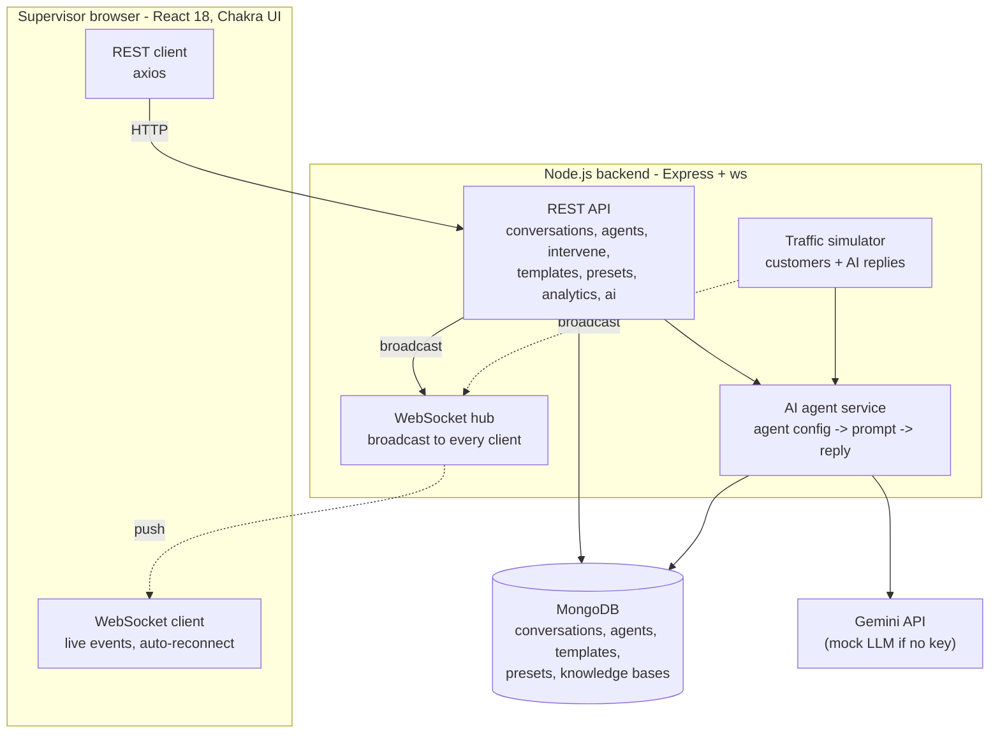
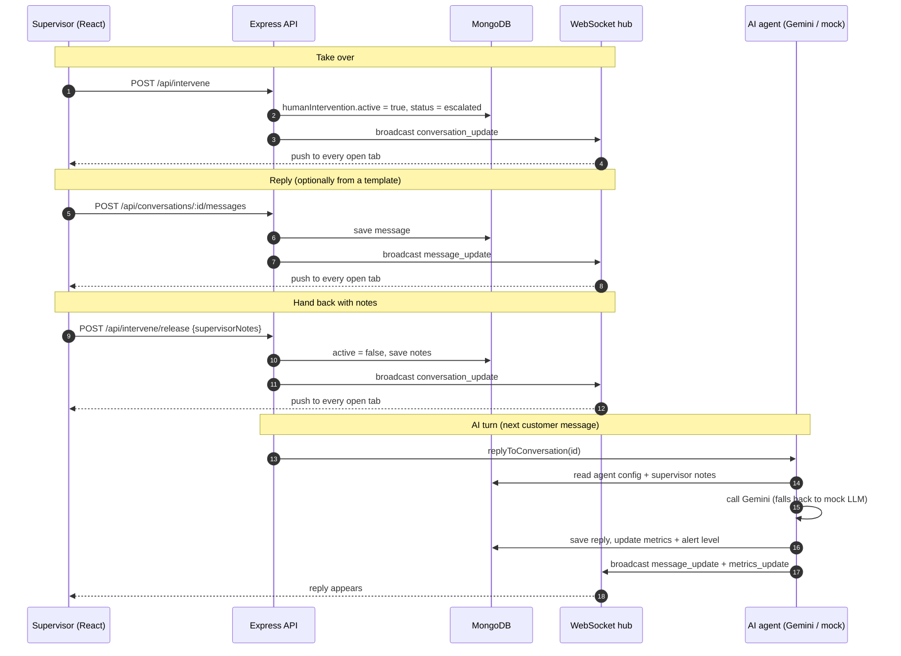

# Architecture

Standalone copy of the diagrams in README.MD. Mermaid renders on GitHub / GitLab / VS Code preview.

## System architecture

## Sequence: take over, reply, hand back, AI turn

A conversation under human control is never answered by the AI: `replyToConversation` refuses (409) while
`humanIntervention.active` is true, including when a supervisor takes over while a reply is being generated.
