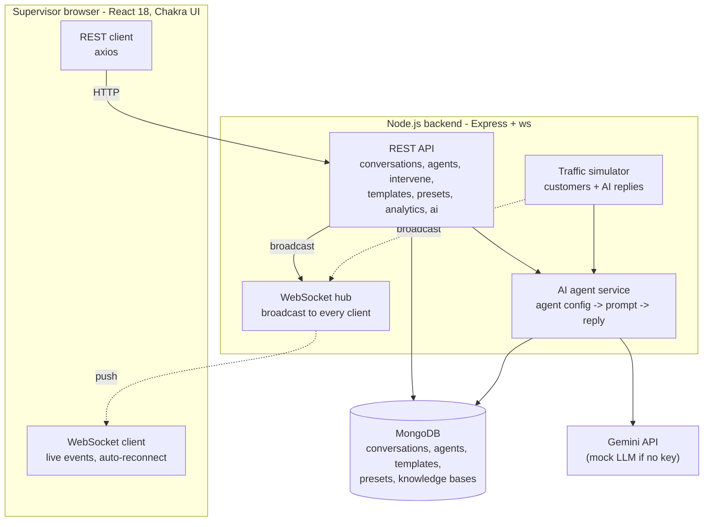
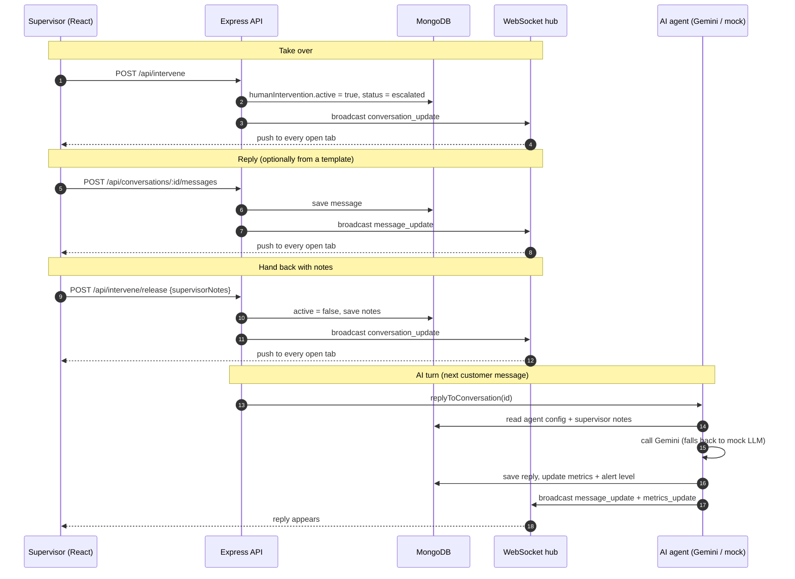

# Zangoh AI Agent Supervisor Workstation

A workstation where human supervisors monitor AI customer-service agents in real time, take over a conversation
when the AI is not enough, hand it back with guidance, tune the agents, and reuse response templates with
`{{variables}}`. Built for the Zangoh supervisor challenge (the original brief is kept in [CHALLENGE.md](CHALLENGE.md)).

- Frontend: React 18, Chakra UI, framer-motion, Recharts, WebSocket client
- Backend: Node.js, Express, `ws`, Mongoose / MongoDB
- AI: Google Gemini with an automatic fallback to the bundled mock LLM (works with no API key)

## Demo video

**2-minute walkthrough:** `<paste video link here>`

## Contents

1. [Quick start](#quick-start)
2. [What is built](#what-is-built)
3. [Architecture](#architecture)
4. [API overview](#api-overview)
5. [Project structure](#project-structure)
6. [Challenges and decisions](#challenges-and-decisions)
7. [Notes for the evaluator](#notes-for-the-evaluator)

---

## Quick start

Prerequisites: Node 16+ (developed on Node 22), MongoDB, and optionally Docker. Qdrant is **not** required: no feature
uses it (only the standalone `vectorDbSetup.js` script does).

### Option A: Docker

```bash
docker-compose up -d
docker-compose exec backend npm run seed
```

- UI http://localhost:3000, API http://localhost:8080, Swagger http://localhost:8080/api-docs
- The compose file starts its own MongoDB on port 27017. If you already run MongoDB locally, stop it first
  (`net stop MongoDB` on Windows) or change the mapping to `"27018:27017"`.
- The source folders are mounted into the containers and file watching uses polling, so frontend edits reload on their own.
  Backend edits need `docker-compose restart backend` (it runs plain `node`, see [decisions](#challenges-and-decisions)).
- After changing `backend-starter/.env` (e.g. adding a Gemini key) recreate the backend: `docker-compose up -d backend`.

### Option B: local Node with local MongoDB

```bash
# terminal 1 - API on :8080
cd backend-starter
npm install
npm run seed        # loads agents, conversations (+14 days of history), knowledge bases, templates, presets
npm start

# terminal 2 - UI on :3000
cd frontend-starter
npm install
npm start
```

`frontend-starter/.env` points the browser at `http://localhost:8080` and `ws://localhost:8080`.

### Enable real AI replies (optional)

Copy `backend-starter/.env.example` to `backend-starter/.env` (git-ignored), paste your key, restart the backend:

```
GEMINI_API_KEY=your_key_here
GEMINI_MODEL=gemini-2.5-flash
```

Check it with `curl http://localhost:8080/api/ai/status` (`"provider":"gemini"`). With no key, or if a Gemini call
fails, the app uses the mock LLM for that call and reports the error in `lastError`. The key is never returned by any API.

### Useful switches (in `backend-starter/.env`)

| Variable | Effect |
|---|---|
| `SIMULATE=false` | turn off the fake live customer traffic |
| `SIMULATOR_INTERVAL_MS` | how often a simulated customer writes (default 6s, 15s with Gemini) |
| `AI_AUTO_REPLY=false` | do not auto-answer customer messages posted to the API |

`npm run seed` resets every collection (including templates and presets) and is safe to re-run.

---

## What is built

| Area | Implementation |
|---|---|
| **Dashboard** | Live conversation ledger over WebSocket. Metric cards (open, resolution, response time, satisfaction, escalated) with a Today / Week / Month range from `GET /api/analytics/overview`. Alert banner and bell for high-alert conversations. Filters by search, status, alert level and agent; sorted by severity. |
| **Alerts** | `utils/alerts.js` derives `low / medium / high` from sentiment, AI confidence and response time against each *agent's own escalation thresholds*. Recomputed on every metrics change and whenever thresholds are edited. |
| **Intervention** | Full history with live updates. **Take over** (with reason), supervisor messaging (only enabled while in control), **Return to AI** with guidance notes, mark resolved, tags, live metric meters that turn persimmon past a threshold, and 1-5 star + category + comment **agent feedback**. While a human is in control the AI stays silent. |
| **Agent configuration** | Temperature, top-p, max tokens, capability and knowledge-base toggles, escalation thresholds. Unsaved-change tracking, reset, server-side range validation, and **presets** (save / load / delete) that apply to any agent. |
| **Response templates (twist)** | Full CRUD at `/api/templates` (`?shared=`, `category`, `search`). Management page with All / Mine / Shared tabs, create and edit modal with automatic variable detection, per-variable descriptions and live preview. In a conversation the **Templates** button opens a picker: choose, fill variables (order number and customer name are pre-filled from the chat), preview, insert into the reply box. |
| **Variables clearly indicated** | Everywhere a template is shown, unfilled `{{variables}}` render as marker-yellow chips; filled ones turn rose and show the value. **Insert** stays disabled and lists what is missing, so a raw placeholder can never be sent to a customer. |
| **AI agent replies** | Gemini (or mock) generates replies from the agent's saved configuration: temperature / top-p / max tokens go into the request, enabled capabilities and knowledge bases into the system prompt, and a supervisor's release notes are passed to the AI as guidance. Customer messages are sentiment-scored by the same layer. |
| **Analysis** | Recharts: conversation volume, response time vs sentiment, most common issues, agent comparison. |
| **Design** | No mockups were supplied (see notes). Own visual language: Midnight + Dusty Rose + Persimmon, frosted glass, editorial type (Fraunces, Hanken Grotesk, JetBrains Mono), staggered drop-in motion, count-up figures, pulsing edge while a human is in control. Motion is disabled under `prefers-reduced-motion`. |

---

## Architecture

### System architecture



Solid arrows are requests, dotted arrows are live pushes. Every REST action that changes state goes through the
WebSocket hub, so all open tabs update at once. The simulator also writes new conversations to MongoDB (omitted for clarity).

### Sequence flow: take over, reply, hand back, AI turn



A conversation under human control is never answered by the AI: `replyToConversation` refuses (409) while
`humanIntervention.active` is true, including when a supervisor takes over while a reply is still being generated.

### Real-time events

`new_conversation`, `conversation_update` (status, alert, intervention), `message_update`, `metrics_update`, `agent_update`.

---

## API overview

Full interactive docs at http://localhost:8080/api-docs.

| Group | Endpoints |
|---|---|
| Conversations | `GET /api/conversations`, `GET /:id`, `POST /:id/messages`, `PATCH /:id/status`, `POST /:id/tags`, `POST /:id/feedback` |
| Intervention | `POST /api/intervene`, `POST /api/intervene/release` |
| Agents | `GET /api/agents`, `GET /:id`, `PATCH /:id/config`, `GET /:id/metrics` |
| Templates | `GET / POST /api/templates`, `GET / PATCH / DELETE /api/templates/:id` |
| Presets | `GET / POST /api/presets`, `DELETE /api/presets/:id` |
| AI | `GET /api/ai/status`, `POST /api/ai/reply`, `POST /api/ai/sentiment`, `POST /api/ai/test-reply` |
| Analytics / KB | `GET /api/analytics/overview?timeRange=`, `GET /api/knowledge-base` |
| Mock LLM | `POST /api/llm/generate`, `/sentiment`, `/knowledge` (the starter's mock, now mounted) |
| WebSocket | `ws://localhost:8080` |

---

## Project structure

```
backend-starter/
  server.js                   Express + ws + Mongo bootstrap, route mounting
  routes/                     conversations, agents, intervene, templates, presets, analytics, ai, knowledgeBase
  models/                     Mongoose schemas
  utils/broadcast.js          registry of WS clients + broadcast()
  utils/alerts.js             threshold -> alert level
  utils/llm.js                Gemini / mock provider (reply + sentiment)
  utils/aiAgent.js            runs the AI agent on a stored conversation
  utils/seed.js               sample data + 14 days of history
  websocket/socketHandler.js  connect / ping / subscribe
  websocket/simulator.js      live customer traffic against the real DB
frontend-starter/src/
  context/                    WebSocketContext (reconnect, listeners), AppDataContext
  pages/                      Dashboard, ConversationView, AgentConfig, Templates, Analysis
  components/                 ConversationList, TemplatePicker, TemplatePreview, motion.js (glass + motion primitives)
  utils/templates.js          variable extraction / substitution / suggestions
  theme.js                    palette, type, glass and motion tokens
ARCHITECTURE.md               the diagrams above, standalone
CHALLENGE.md                  the original challenge brief
```

---

## Challenges and decisions

- **Starter WebSocket was fake.** It imported a non-existent `conversations` export and sent random per-connection
  data. Replaced with a shared broadcaster and one DB-backed simulator, so REST actions push real events to every tab.
- **Dropped events.** Keeping only `lastMessage` in React state loses events that arrive in the same render. The
  WebSocket context exposes `addListener`, and the data layer and conversation view subscribe to every message. A message
  the UI sent itself is de-duplicated against its own broadcast echo (sender + text + timestamp).
- **Take-over semantics.** `humanIntervention.occurred` is history; the new `active` flag says who is in control now.
  Take-over is idempotent, so retries and double clicks are safe.
- **Templates.** The server is the source of truth for `variables`: rebuilt from `{{name}}` occurrences on every
  create/update, keeping supplied descriptions and dropping stale entries.
- **AI provider layer.** One module (`utils/llm.js`) hides Gemini vs mock, so the rest of the app never branches on it.
  Gemini 2.5 models "think" by default and that budget is taken from `maxOutputTokens`, so thinking is disabled for them.
- **Docker.** `.env` used the hostname `backend`, which a browser cannot resolve; fixed. `nodemon` was not resolvable
  inside the container's mounted `node_modules`, so the backend runs `npm start`. Bind mounts on Windows do not deliver file-change
  events, so the frontend uses polling.
- **Mounted the mock LLM.** `mockLlmApi.js` had a wrong relative require and was never mounted; both fixed.

## Notes for the evaluator

- **No mockups were provided.** The brief mentions a `mockups` folder and a `[FIGMA_LINK_HERE]` placeholder; neither exists
  in the materials. Layout follows the starter's structure and the visual language is my own.
- The provided `testing/test-runner.js` needs `puppeteer` and `chalk`. I verified the API layer with an equivalent script
  (all endpoints, error paths and validation) and exercised the UI flows in a browser instead.
- The Gemini integration was verified up to the API call: a bad key returns Google's error and falls back cleanly.
  It was not exercised with a real key.
- There is no authentication; the acting supervisor is the constant `supervisor-001`.
- Fonts load from Google Fonts; system serif / sans fallbacks apply offline. The workstation is dark-only.
- The starter's `simulateDelay` calls remain on read endpoints; they were removed from the write paths I touched.
